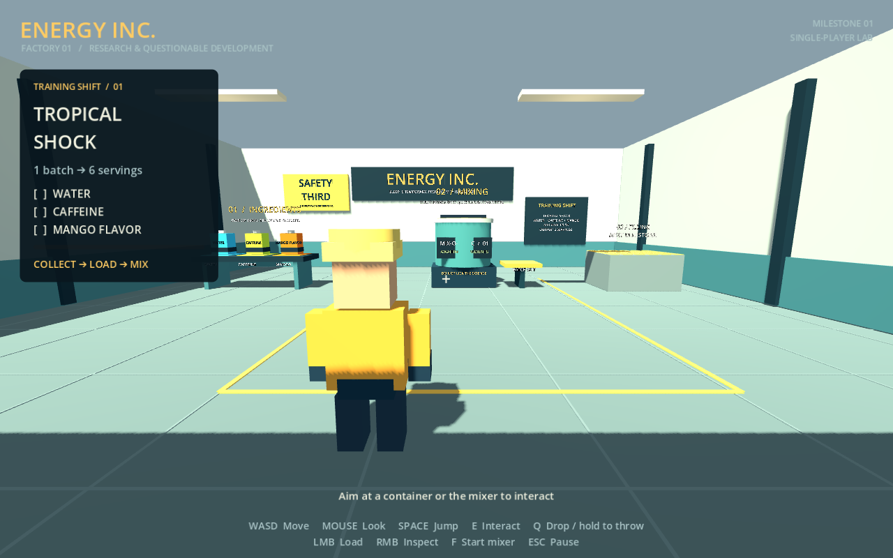

# ENERGY INC.

**Sleep is temporary. Productivity is forever.**

An original, stylized 3D energy-drink factory game in Godot 4 / GDScript. This repository contains **Milestone 01: a playable single-player mixing lab**, not the final multiplayer game.



## Run

1. Install Godot **4.6.x standard** (tested with 4.6.3; no .NET build or addons required).
2. Import `project.godot` and press **F5**, or run `godot --path .` from this folder.
3. Aim the crosshair at an ingredient on the left bench and press E / X / Square.
4. Carry it to the teal mixer, aim at the machine, and press E or left mouse / X or RT.
5. Repeat for **water, caffeine and mango**. Start with E/F or X/RB while aiming at the mixer.
6. Wait five seconds, then pick up the orange six-serving batch from the output tray to the mixer's right. Fresh ingredients appear for another attempt.

The filling station is visibly marked **NEXT MILESTONE**. Cans, orders, countdown deadlines, delivery and money are not implemented yet. The current timer is the mixer's processing timer.

## Controls

| Action | Keyboard / mouse | Xbox | PlayStation |
|---|---|---|---|
| Move | WASD | Left stick | Left stick |
| Camera | Mouse | Right stick | Right stick |
| Jump | Space | A | Cross |
| Grab / load / start | E | X | Square |
| Use held ingredient at machine | Left mouse | RT | R2 |
| Inspect held object | Right mouse | LT | L2 |
| Drop / charge throw | Tap / hold then release Q | B | Circle |
| Start targeted mixer | F | RB | R1 |
| Pause / release mouse | Esc | Start / Menu | Options |

Controller names describe Godot's standardized button layout. Current player uses gamepad device 0. Prompts switch automatically on mouse/keyboard or controller activity. Pause menu supports directional focus and confirm. Hardware testing is still required on Xbox and PlayStation controllers; see test notes.

## Repository

- `actors/player/`: movement, input source, camera, interaction, dynamic grabber, worker visuals.
- `items/`: physical ingredient / batch scene and ownership lifecycle.
- `ingredients/`, `recipes/`: typed configuration Resources and Tropical Shock data.
- `machines/`: common state machine, mixer simulation, separate presentation and scene.
- `factory/`: main scene, primitive builder, one graybox room.
- `systems/`, `ui/`: composition, supply, pause, input bindings and HUD.
- `orders/`, `audio/`, `resources/`: reserved next-stage content directories.
- `tests/`: real-scene integration suite and rendered capture script.
- [ARCHITECTURE.md](ARCHITECTURE.md): responsibilities, signals, physics tradeoffs and co-op seams.
- [ROADMAP.md](ROADMAP.md): acceptance criteria and staged development plan.

## Verify

```sh
godot --headless --editor --path . --quit
godot --headless --path . --script tests/run_tests.gd
godot --headless --path . --quit-after 180
```

The test runner prints a check count and exits nonzero on failure. The initial editor import builds Godot's class/UID cache for a clean checkout. Ignore `.godot/`; commit source `.uid` sidecars.

On Linux/macOS, `tests/run_checks.sh` runs all three checks and also fails on engine error log lines (Godot does not always return a nonzero exit code for those).

Optional visual smoke test, with a working graphical display:

```sh
godot --path . --script tests/capture_preview.gd
```

This saves the real viewport to `docs/milestone-01.png`. Restricted build runners can direct `XDG_DATA_HOME`, `XDG_CONFIG_HOME`, and `XDG_CACHE_HOME` to writable temporary directories. No environment-specific absolute paths are required by the project.
