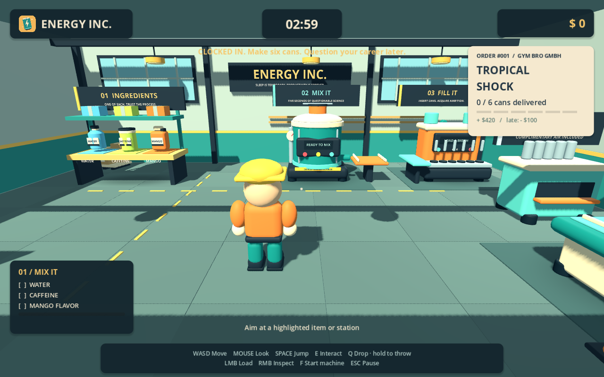

# ENERGY INC.

**Sleep is temporary. Productivity is forever.**

Original stylized 3D factory game, built with **Godot 4.6 / GDScript**. Version **0.2.0** is a playable single-player production shift with original rounded 3D models, animated worker, controller mappings, sound, orders and money.

## Mac: herunterladen und direkt spielen

**[ENERGY-INC-macOS.zip herunterladen](https://github.com/redboxergaming-hash/ENENERGYway/raw/refs/heads/work/downloads/ENERGY-INC-macOS.zip)** · [Mac-Anleitung](downloads/README.md)

ZIP entpacken, `ENERGY INC.app` in Programme ziehen und öffnen. **Godot muss nicht installiert sein.** Die App enthält Apple-Silicon- und Intel-Binaries. Sie ist ad-hoc signiert, aber nicht Apple-notarisiert; falls macOS sie blockiert, siehe die Anleitung. Ein nativer Test auf einem echten Mac steht noch aus.



## Play the full production loop

1. Your first order is **6 × Tropical Shock** for **Gym Bro GmbH**, due in **180 seconds**.
2. Take **water, caffeine and mango** from the ingredient bench. Aim at the mixer and interact to load each.
3. Start the mixer and wait **five seconds**. Take the orange batch from its side tray.
4. Carry the batch to the orange **filler** and interact to transfer its six servings.
5. Take six **empty cans** from the mint-colored can dispenser beside the filler. Insert each into the filler.
6. Start the filler. It fills the queued cans one at a time, retaining the six physical outputs on its side tray.
7. Carry each finished can to the **delivery desk** by the shutter. Interact with the desk to deliver.
8. Six matching cans pay **$420**. A new order appears after three seconds. Timeout costs **$100**, then another order begins.

Materials replenish after collecting a mixer batch. Empty cans are available from the dispenser. Pause freezes the order deadline and all machines. Restart shift clears the room, inventories and balance.

## Controls

| Action | Keyboard / mouse | Xbox | PlayStation |
|---|---|---|---|
| Move | WASD | Left stick | Left stick |
| Camera | Mouse | Right stick | Right stick |
| Jump | Space | A | Cross |
| Grab / load / deliver / start | E | X | Square |
| Use held object at station | Left mouse | RT | R2 |
| Inspect held object | Right mouse | LT | L2 |
| Drop / charge throw | Tap / hold then release Q | B | Circle |
| Start targeted machine | F | RB | R1 |
| Pause | Esc | Start / Menu | Options |

Idle camera orbit lets you see the worker from the front. While moving, the worker faces the direction of travel; while carrying, the worker faces the held object. Targets receive a warm outline, with a small, wall-respecting targeting allowance for small cans. Pause menu includes restart, fullscreen and quit.

Current player uses gamepad device 0. Button names describe Godot's standardized layout. Prompts switch based on input activity. Physical Xbox/PlayStation hardware still needs validation.

## Develop / run from source

Install Godot **4.6.x standard**, import `project.godot`, and press F5. No addons, .NET, Blender or external services are required to play. Generated `.glb` models, fonts, sound and configuration Resources are committed.

```sh
godot --headless --editor --path . --quit
./tests/run_checks.sh
```

The shell runner checks import errors, the original 69-check mixing suite, the 83-check complete production suite, and startup. See [tests/README.md](tests/README.md) for measured coverage and limits.

```sh
godot --path . --script tests/capture_preview.gd
godot --headless --path . --export-release macOS downloads/ENERGY-INC-macOS.zip
python3 tools/package_macos.py
python3 tools/verify_macos_export.py
```

Export requires matching Godot 4.6.3 templates. The preset generates a universal Mac `.app` inside a ZIP with built-in ad-hoc code signing. Apple certificates/notarization are intentionally not configured. Test scripts, screenshots, generators and downloads are excluded from the game package. The Mac ZIP is intentionally committed as the current development download, so users can obtain it without CI accounts or Git LFS; future releases should move binaries to a dedicated release pipeline.

Art can be regenerated with `blender --background --factory-startup --python tools/build_art.py`. Sounds can be regenerated with `python3 tools/build_audio.py`. Neither tool is needed at runtime.

## Architecture and scope

- `actors/player/`: movement, scoped input, camera, interaction, physics grabber, worker animation.
- `art/`: original Blender-generated mesh kit, shaders, icon, licensed Open Sans fonts.
- `items/`, `ingredients/`, `recipes/`: typed item/ingredient/recipe Resources and physical instances.
- `machines/`: common machine state, mixer, filler, can dispenser and presentation.
- `orders/`: resource-backed orders, countdown, atomic delivery and money ledger.
- `factory/`, `systems/`, `ui/`, `audio/`: room, composition, feedback, displays and sound.
- [ARCHITECTURE.md](ARCHITECTURE.md) · [ROADMAP.md](ROADMAP.md) · [THIRD_PARTY_NOTICES.md](THIRD_PARTY_NOTICES.md)

This version is **single-player**. Local/online co-op, separate sealing/labeling/packing, chaos events, progression and Steam APIs remain future milestones. The filler currently produces ready-to-deliver cans as the deliberately simplified vertical-slice process.
